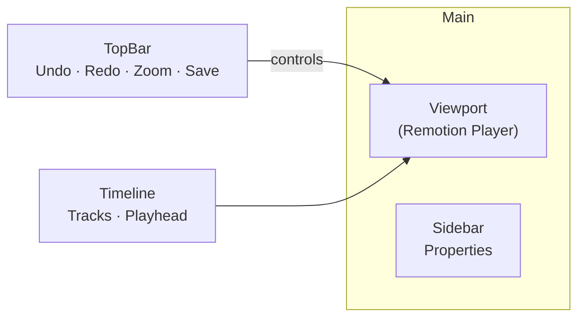

# Browser-Based Video Editor (MVP)

> Live, WYSIWYG timeline editor that produces the JSON used by the Remotion render-engine.

---

## High-Level Layout



* **Viewport** – Embeds `<Player>` at 480p for instant feedback.
* **Sidebar** – Shows context-sensitive panels (Transform, Crop, Audio…).
* **Timeline** – Multiple draggable tracks (`react-dnd`).

---

## Core State (zustand)
```ts
interface Clip {
  id: string;
  trackId: string;
  src: string;
  start: number; // timeline frame
  end: number;
  trimIn: number; // source frame
  trimOut: number;
  props: Record<string, unknown>; // position, scale, etc.
}

interface TimelineStore {
  fps: number;
  width: number;
  height: number;
  tracks: {id: string; type: 'video'|'audio'|'caption'}[];
  clips: Clip[];
  playhead: number;
  selection: string | null;
}
```

The same object serialises to our EDL-JSON.

---

## Interaction Flow
1. User drags clip edges → `clips.end` updates.
2. Store notifies `<Player>` via `inputProps` → preview refreshes.
3. Selecting a clip populates Sidebar form → edits mutate clip.props.
4. **Auto-Save** debounces and persists JSON to Supabase.

---

## MVP Checklist
- [ ] Timeline ruler + zoom
- [ ] One video track with draggable/resizeable clips
- [ ] Play / pause sync between Player & playhead
- [ ] Sidebar: Transform (x, y, scale), Trim fields
- [ ] Export JSON button (for manual render)

Post-MVP: multi-track, transitions, caption track, keyboard shortcuts. 

<br/>

<!-- Static diagram for GitHub -->
 