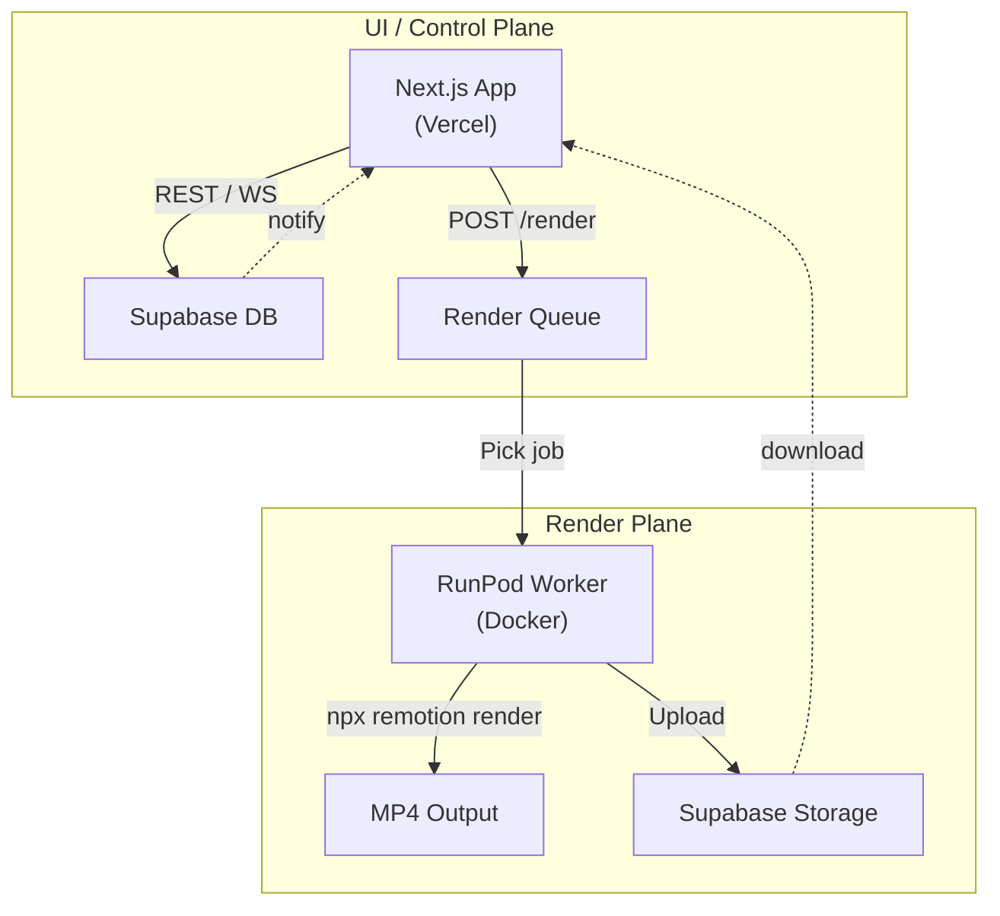

# JSON-Driven Video Builder – Road-map

> Goal: Render fully-edited videos from an AI-generated JSON timeline using Remotion.

---

## 0. Kick-off
| Task | Details |
|------|---------|
| 0.1 Requirements | Define input (assets + JSON) and output (mp4). |
| 0.2 Tech stack   | Remotion v4, Next 15, Node 20, Tailwind 4, Supabase. |
| 0.3 Repo & CI    | ESLint, type-check, unit tests, preview deploy (GitHub Actions). |

---

## 1. Timeline Schema & Data Layer
- Design EDL JSON schema (global + `events[]`).
- Create TypeScript types & Zod validation.
- Supabase `timelines` table (CRUD).
- API routes: `POST /edl`, `GET /edl/:id`, `PATCH`, `DELETE`.

---

## 2. Remotion Rendering Engine
- `JsonDrivenVideo` component interprets JSON → `<Sequence>` layers.
- Helper renderers: video, image, text, audio, transition.
- Utilities: `secToFrame`, asset preloading, error boundary.
- Unit tests for mapping logic.

---

## 3. AI Integration & JSON Builder
- Prompt design for OpenAI function-calling to emit timeline JSON.
- Serverless `/api/generate-edl` → returns validated JSON.
- Manual fallback editor (Monaco JSON + schema hints).

---

## 4. User Interface
- Dashboard: list timelines, create new.
- Timeline detail: JSON editor, live `<Player>` preview, property panel.
- Actions: "Render HD", delete, clone.

---

## 5. Rendering Pipeline
1. Preview: client `<Player>` (480p, muted).
2. HD render queue:
   - API `/api/render` → job row.
   - Worker (RunPod) runs `npx remotion render` with props.
   - Upload mp4 to Storage, update job status.
3. Optional FFmpeg post-processing.

---

## 6. Testing & QA
- Unit: schema + helpers.
- Integration: sample timelines rendered, frame checksum.
- E2E (Cypress): full create → render flow.

---

## 7. Performance & Cost
- Cache intro/outro segments.
- WebCodecs for high-fps preview.
- Lambda concurrency limits & alerts.

---

## 8. Polish & Launch
- Responsive theming & branding.
- Docs, onboarding, sample assets.
- Monitoring (Sentry) & analytics.

---

## Milestone Calendar (ideal)
| Week | Deliverables |
|------|--------------|
| 1 | Schema + interpreter prototype (Ph 1-2). |
| 2 | Preview UI with manual JSON editor. |
| 3 | AI EDL generator + Supabase storage. |
| 4 | Render pipeline MVP. |
| 5 | Transition library, captioning, tests. |
| 6 | Performance, docs, beta launch. | 

 

<!-- Static render for GitHub preview -->
 